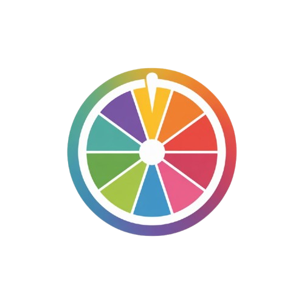

# 🎯 Decision Roulette

<div align="center">
  
  
  **The Ultimate Decision-Making Tool**
  
  *Transform your tough choices into an exciting game of chance!*

  [](https://priyanshu84iya.github.io/Decision-Roulette/)
  [](LICENSE)
  [](https://github.com/Priyanshu84iya/Decision-Roulette/stargazers)
  [](https://github.com/Priyanshu84iya/Decision-Roulette/network)

</div>

---

## ✨ Features

### 🎨 **Premium UI Experience**
- **Glassmorphism Design** - Modern, translucent interface with blur effects
- **Dark/Light Mode** - Seamless theme switching with system preference detection
- **Responsive Design** - Perfect experience across desktop, tablet, and mobile devices
- **Premium Animations** - Smooth transitions and engaging micro-interactions

### 🎪 **Interactive Roulette Wheel**
- **Canvas-Based Animation** - Smooth, hardware-accelerated spinning animations
- **Dynamic Segmentation** - Wheel automatically adjusts based on number of options
- **Visual Feedback** - Glowing effects and winner highlighting
- **Realistic Physics** - Natural deceleration and stopping mechanics

### 🔊 **Immersive Audio**
- **Spin Sound Effects** - Engaging audio feedback during wheel rotation
- **Victory Sounds** - Celebratory audio when a winner is selected
- **Sound Management** - Easy mute/unmute with proper cleanup

### 📱 **Social Features**
- **Web Share API** - Native sharing on supported devices
- **Clipboard Integration** - Copy results with one click
- **Social Media Buttons** - Quick sharing to multiple platforms
- **Result Sharing** - Share your decision with friends instantly

### 🚀 **Advanced Functionality**
- **Auto-Suggestions** - Pre-filled option categories for quick setup
- **Custom Options** - Add unlimited personalized choices
- **Result History** - Remember previous decisions
- **Confetti Celebrations** - Animated celebrations for winners
- **Loading Animations** - Beautiful geometric SVG loaders

---

## 🖼️ Screenshots

<div align="center">
  
### 💡 Light Mode


### 🌙 Dark Mode  


### 📱 Mobile Responsive


</div>

---

## 🚀 Quick Start

### 🌐 **Try It Online**
Visit the live demo: **[Decision Roulette](https://priyanshu84iya.github.io/Decision-Roulette/)**

### 💻 **Local Development**

1. **Clone the repository**
   ```bash
   git clone https://github.com/Priyanshu84iya/Decision-Roulette.git
   cd Decision-Roulette
   ```

2. **Open in your browser**
   ```bash
   # Using Python (if installed)
   python -m http.server 8000
   
   # Using Node.js (if installed)
   npx serve .
   
   # Or simply open index.html in your browser
   ```

3. **Start making decisions!** 🎯

---

## 🎮 How to Use

### 📝 **Step 1: Add Your Options**
- Type your choices in the input field
- Click "Add Option" or press Enter
- Use auto-suggestions for common decision categories
- Add as many options as you need!

### 🎲 **Step 2: Spin the Wheel**
- Click the central "SPIN" button
- Watch the wheel spin with realistic physics
- Enjoy the suspenseful animation and sound effects

### 🏆 **Step 3: Get Your Result**
- See the winning option highlighted
- Enjoy the confetti celebration
- Share your result with friends
- Try again or reset for new decisions

---

## 🛠️ Technical Stack

### **Frontend Technologies**
-  **HTML5** - Semantic structure and Canvas API
-  **CSS3** - Modern styling with custom properties and animations
-  **Vanilla JavaScript** - ES6+ with object-oriented architecture

### **Design Features**
- 🎨 **CSS Custom Properties** - Dynamic theming system
- 🌊 **Glassmorphism Effects** - Modern UI design trends
- 📱 **Responsive Grid/Flexbox** - Mobile-first responsive design
- ⚡ **CSS Animations** - Hardware-accelerated transitions
- 🎭 **SVG Graphics** - Scalable icons and animations

### **Browser APIs**
- 🎨 **Canvas API** - High-performance wheel animations
- 📤 **Web Share API** - Native sharing capabilities
- 📋 **Clipboard API** - Copy functionality
- 🔊 **Web Audio API** - Sound effects management
- 💾 **LocalStorage** - Settings persistence

---

## 📁 Project Structure

```
Decision-Roulette/
├── 📄 index.html          # Main HTML structure
├── 🎨 style.css           # Comprehensive styling
├── ⚡ script.js           # Core application logic
├── 📖 README.md           # Project documentation
└── 📁 assets/             # Static resources
    ├── 🖼️ logo.svg         # Application logo
    ├── 🖼️ logo.png         # PNG logo variant
    ├── 🔊 spin.wav         # Spin sound effect
    ├── 🔊 win.wav          # Winner sound effect
    ├── 🌐 site.webmanifest # PWA manifest
    └── 📱 [favicons]       # Various favicon sizes
```

---

## ⚙️ Configuration

### 🎨 **Customizing Themes**
Modify CSS custom properties in `style.css`:

```css
:root {
  --bg-color: linear-gradient(135deg, #667eea 0%, #764ba2 100%);
  --text-color: #ffffff;
  --btn-color: #4ecdc4;
  --glow-color: #4ecdc4;
  /* Add your custom colors */
}
```

### 🔊 **Audio Settings**
Replace sound files in the `assets/` directory:
- `spin.wav` - Wheel spinning sound
- `win.wav` - Winner celebration sound

### 🎯 **Auto-Suggestions**
Add custom option categories in `script.js`:

```javascript
const suggestionCategories = {
  "Custom Category": ["Option 1", "Option 2", "Option 3"]
};
```

---

## 🌟 Key Features Breakdown

<details>
<summary><strong>🎨 Premium UI Components</strong></summary>

- **Uiverse.io Integration** - Premium animated components
- **Adobe-Style Social Ring** - Innovative sharing interface
- **Geometric Loaders** - SVG-based loading animations
- **Neumorphic Design** - Soft UI elements with depth
- **Glass Cards** - Translucent containers with backdrop blur

</details>

<details>
<summary><strong>🎯 Roulette Engine</strong></summary>

- **Dynamic Canvas Rendering** - Real-time wheel generation
- **Physics-Based Animation** - Realistic spinning mechanics
- **Automatic Segmentation** - Equal distribution of options
- **Visual Indicators** - Pointer and winner highlighting
- **Smooth Transitions** - Eased animations for natural feel

</details>

<details>
<summary><strong>📱 Cross-Platform Compatibility</strong></summary>

- **Mobile-First Design** - Optimized for touch interfaces
- **Progressive Enhancement** - Works on all modern browsers
- **PWA Features** - Web app manifest and favicons
- **Touch Gestures** - Mobile-friendly interactions
- **Responsive Breakpoints** - Adaptive layouts for all screen sizes

</details>

---

## 🤝 Contributing

We welcome contributions! Here's how you can help:

### 🐛 **Bug Reports**
1. Check existing issues first
2. Create detailed bug reports with steps to reproduce
3. Include browser information and screenshots

### ✨ **Feature Requests**
1. Propose new features with clear use cases
2. Discuss implementation approaches
3. Consider backward compatibility

### 🔧 **Pull Requests**
1. Fork the repository
2. Create a feature branch: `git checkout -b feature/amazing-feature`
3. Commit changes: `git commit -m 'Add amazing feature'`
4. Push to branch: `git push origin feature/amazing-feature`
5. Open a Pull Request

---

## 📜 License

This project is licensed under the **MIT License** - see the [LICENSE](LICENSE) file for details.

```
MIT License - Feel free to use, modify, and distribute!
```

---

## 👨‍💻 Author

<div align="center">

**Priyanshu Raj**

[](https://github.com/Priyanshu84iya)
[](https://linkedin.com/in/priyanshu84iya)
[](https://instagram.com/priyanshu84iya)
[](https://youtube.com/@priyanshu84iya)

*Passionate about creating beautiful, functional web experiences*

</div>

---

## 🙏 Acknowledgments

- **[Uiverse.io](https://uiverse.io)** - Premium UI component inspiration
- **Canvas API** - For smooth wheel animations
- **Web Share API** - For seamless sharing capabilities
- **CSS-Tricks** - For advanced CSS techniques
- **MDN Web Docs** - For comprehensive web standards reference

---

## 📊 Stats

<div align="center">


</div>

---

<div align="center">

**Made with ❤️ and ☕ by [Priyanshu Raj](https://github.com/Priyanshu84iya)**

*If you found this project helpful, please consider giving it a ⭐!*

### 🚀 [Try Decision Roulette Now!](https://priyanshu84iya.github.io/Decision-Roulette/)

</div>
